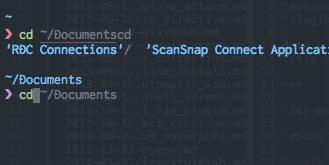

+++
title = "Zsh autosuggestions"
date = 2016-09-25T23:53:12+09:00
draft = false
description = ""
[taxonomies]
categories = [ "zsh" ]
tags = [ "zsh", "autosuggestions", "plugin" ]
+++

`zsh-autosuggestions` という便利な *zsh* のプラギンを見つけた。

`zplug` を使って簡単にインストール可能。

```zsh
zplug "zsh-users/zsh-autosuggestions"
```

あとは、表示された補完を決定するキーの設定を追加。
ちなみにデフォルトだと、右矢印が割り当てられてる模様。

```zsh
bindkey '^ ' autosuggest-accept
```

で、 `Ctrl + Space` で、補完候補が確定する。



べんり。


